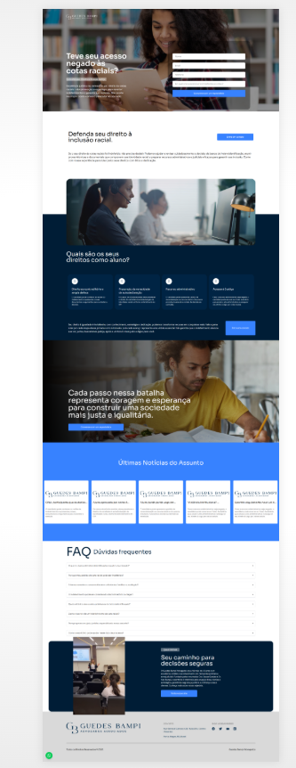

# ⚖️ Landing Page: Defesa de Cotas Raciais

Este repositório apresenta uma Landing Page (LP) de alta conversão desenvolvida para o escritório **Guedes Bampi Advogados**. O projeto foi desenhado para oferecer clareza jurídica e um canal direto de contato para candidatos que tiveram seus direitos à inclusão racial indeferidos em concursos e seleções.

**🔗 Link em Produção:** [cotasraciais.guedesbampi.com.br](https://cotasraciais.guedesbampi.com.br/)

---

## 🏗️ Arquitetura e Propósito

Diferente de um site institucional completo, esta LP foi projetada como uma ferramenta de **Lead Generation** (geração de contatos), focando em uma única dor do cliente e oferecendo uma solução imediata.

1.  **Single Page Application (SPA):** Navegação rápida e fluida sem recarregamento de página.
2.  **Conversão Direta:** Formulários e botões de WhatsApp estrategicamente distribuídos para maximizar a taxa de contato.
3.  **Autoridade Visual:** Design que equilibra a seriedade do tema com a acessibilidade necessária para o usuário final.

---

## 🚀 Funcionalidades Técnicas em Destaque

### 📱 Performance e UX
* **Mobile First:** Interface totalmente otimizada para dispositivos móveis, garantindo que o formulário de contato seja fácil de preencher em qualquer tela.
* **Carregamento Otimizado:** Uso de Next.js para garantir que a página carregue instantaneamente, reduzindo a taxa de rejeição.
* **Componentes de FAQ:** Implementação de sanfonas (accordions) para dúvidas frequentes, melhorando a experiência do usuário sem poluir o visual.

### ⚙️ Engenharia de Frontend
* **Tailwind CSS:** Estilização baseada em utilitários para garantir um layout leve e consistente com a identidade visual da marca.
* **Formulário de Contato Profissional:** Validação de campos em tempo real para garantir que os leads cheguem com as informações corretas ao escritório.
* **SEO Local & de Nicho:** Configuração de meta tags focadas em palavras-chave específicas do setor jurídico de cotas.

---

## 📸 Evidências Técnicas (Showcase)

### 🖥️ Interface de Conversão (Hero Section)

  

### 📖 Conteúdo e Esclarecimentos

  
  

### 📩 Fluxo de Captação

  

  

---

## 🛠️ Stack Tecnológica

| Camada | Tecnologias |
| :--- | :--- |
| **Framework** | Next.js |
| **Estilização** | Tailwind CSS |
| **Linguagem** | TypeScript |
|**Infraestrutura** | Linux VPS, Nginx, SSL (Certbot) |

---

> **Nota Técnica:** Este projeto demonstra minha capacidade de criar páginas focadas em resultados de negócio, onde a tecnologia serve para simplificar a jornada de conversão do usuário.

---
## 👤 Autor
**Tiago R. Becker** – Desenvolvedor Fullstack especializado em transformar estratégias de negócio em interfaces de alta performance.